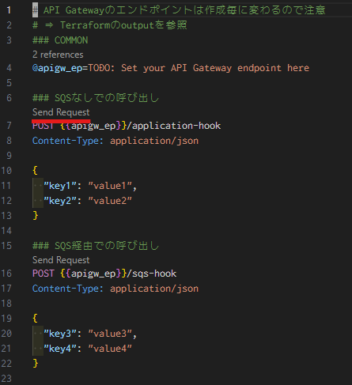

# IaC で Webhook イベントのキューイングを構築


[豆蔵デベロッパーサイト - IaC で Webhook イベントのキューイングを構築](https://developer.mamezou-tech.com/in-house-project/sss/webhook-with-sqs/)のリポジトリです。

動作確認した Terraform のバージョン

```bash:output
Terraform v1.13.4
on windows_amd64
+ provider registry.terraform.io/hashicorp/archive v2.7.1
+ provider registry.terraform.io/hashicorp/aws v6.12.0
+ provider registry.terraform.io/hashicorp/template v2.2.0
```

# `terraform.tvfar_template`ファイルについて

`terraform.tfvars_template`ファイルは`.tfvars`ファイルのテンプレートです。
ファイル名を`terraform.tfvars`に変更して、ファイルに定義されている変数に自分の環境の値を設定します。

# 動作確認について

## はじめに

動作確認に際して以下のことを前提としています。

- Terraform でサーバ構築が済んでいること
- VSCode および REST Client 拡張がインストールされていること

## 準備

1. `rest_client/webhook_with_sqs.http`を VSCode などで開く
1. API Gateway のエンドポイントを確認する
   1. ターミナルで本リポジトリの`iac`ディレクトリを開く
   1. 環境変数などで Terraform の接続設定をする
   1. API Gateway のエンドポイントを Terraform で確認する
      ```bash
      terraform output apigateway_endpoint
      ```
1. 確認した API Gateway のエンドポイントを `@apigw_ep`に設定する
   ```
   @apigw_ep=Terraformで確認した値
   ```

## 動作確認

1. `rest_client/webhook_with_sqs.http`を VSCode で開く
1. 呼び出す Webhook の上に表示されている"SendRequest" をクリック
   - 
1. CloudWatch のログなどを確認する
   - `/aws/lambda/mz-dev-webhook-application`
     - 
   - `/aws/lambda/mz-dev-webhook-event-producer`
     - 
